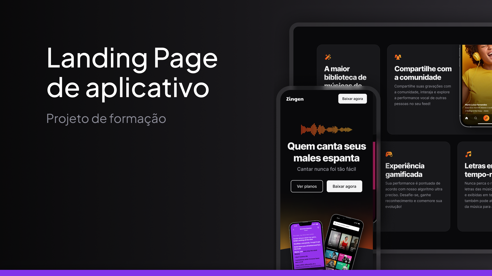

<h1 align="center"> Zingen Landing Page </h1>

Uma Landing Page de um produto fictício feito como forma de estudos do curso Fullstack da Rocketseat

<a href="https://guilhermedkdk.github.io/LP-zingen/">🔗 Live Preview</a>&nbsp;&nbsp;&nbsp;|&nbsp;&nbsp;&nbsp;
<a href="#-tecnologias">🚀 Tecnologias</a>&nbsp;&nbsp;&nbsp; |&nbsp;&nbsp;&nbsp;&nbsp;
<a href="#-projeto">💻 Projeto</a>&nbsp;&nbsp;&nbsp;|&nbsp;&nbsp;&nbsp;
<a href="#-aprendizados">📚 Aprendizados</a>

## 🚀 Tecnologias

Esse projeto foi desenvolvido com as seguintes tecnologias:

- HTML e CSS
- Git e Github
- FIGMA

## 💻 Projeto

A Zingen Landing Page foi um mini projeto do curso Fullstack da Rocketseat no módulo "HTML e CSS Avançado". Nele, apliquei conceitos de CSS avançado para desenvolver uma página responsiva. Trabalhei com media queries, adotei a abordagem mobile first e utilizei funções de CSS para garantir uma adaptação eficiente do layout em diferentes tamanhos de tela, consolidando os conhecimentos sobre responsividade.

## 📚 Aprendizados

Este projeto foi feito dentro do curso de Fullstack no módulo "HTML e CSS Avançado" da Rocketseat.
Nele pude consolidar os conhecimentos sobre:

### CSS
- Responsividade
- Media Queries
- Mobile First
- Funções
